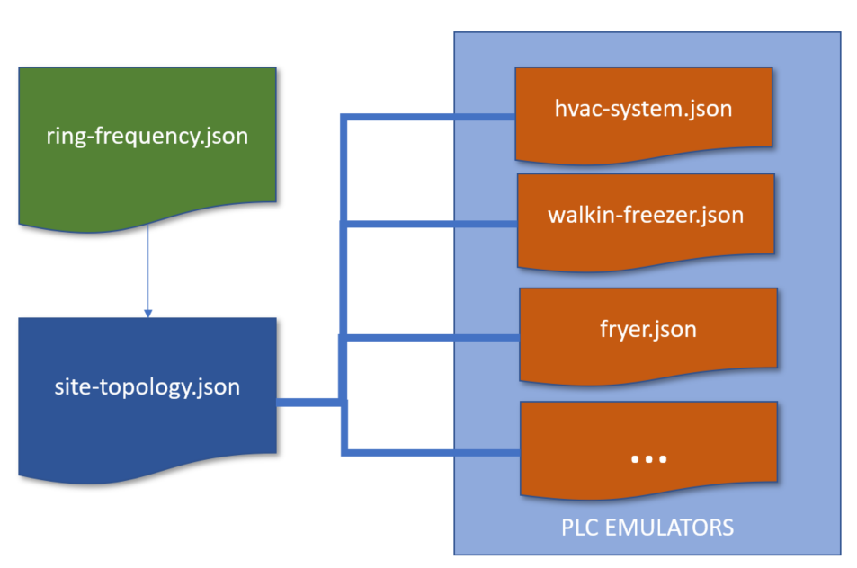

# Smart Kitchen Dynamic OPC-UA Emulation
Demonstrates the use of OPC-UA to Monitor the Equipment in a Smart Commercial Kitchen with Telemetry and Integration.

This project is targeted at system integrators, developers and administrators of an OPC-UA system. This project is for learning purposes and supports the OPC-UA emulation, modeling and Azure IoT concepts that will help you gain deeper knowledge of this scenario.

<b>IMPORTANT:</b> If you are pursuant of a production or commercial implementation of Industrial IoT with Azure you should start here {{{TDB}}}

## Overview
This demonstration is a reference implementation of the following...

* <b>OPC-UA Server</b> - Based on the popular FreeOPcUa project for Python.
* <b>Powerful Emulation</b> - Dynamic Configuration of OPC-UA Server, Nodes and Variables allow you to emulate topologies. In this project it is an instance of a Smart Commercial Kitchen.

## Who is Audience for this Project?
* System Integrators
* Developers
* Administrators of an OPC-UA System

## Configuration Overview
The overall goal of the emulation project is to use a series of related configuration files that support declarative definition of the telemetry from the OPCUA server. This approach makes it trivial to generate a large number of PLC emulations with fine grained control over the telemtry emiting frequency for subscribing clients.

The Files and Relationships

